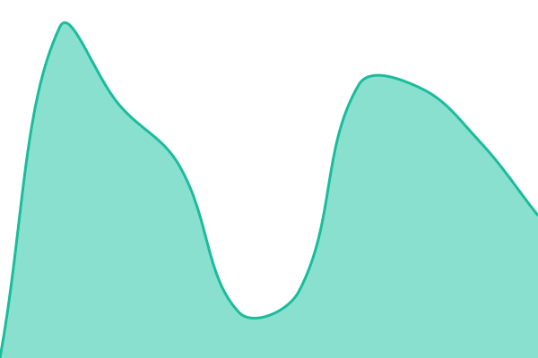

# [📈 Live Status](https://kriskodira.github.io/uptime-monitor): <!--live status--> **🟧 Partial outage**

This repository contains the open-source uptime monitor and status page for [Kris](https://krisnetics.com), powered by [Upptime](https://github.com/upptime/upptime).

With [Upptime](https://upptime.js.org), you can get your own unlimited and free uptime monitor and status page, powered entirely by a GitHub repository. We use [Issues](https://github.com/kriskodira/uptime-monitor/issues) as incident reports, [Actions](https://github.com/kriskodira/uptime-monitor/actions) as uptime monitors, and [Pages](https://kriskodira.github.io/uptime-monitor) for the status page.

<!--start: status pages-->
<!-- This summary is generated by Upptime (https://github.com/upptime/upptime) -->
<!-- Do not edit this manually, your changes will be overwritten -->
<!-- prettier-ignore -->
| URL | Status | History | Response Time | Uptime |
| --- | ------ | ------- | ------------- | ------ |
|  [🍚🛍 TextTextBaby COM](https://texttextbaby.com) | 🟩 Up | [text-text-baby-com.yml](https://github.com/KrisKodira/uptime-monitor/commits/HEAD/history/text-text-baby-com.yml) | 

 1487ms
     
 | 

<a href="https://kriskodira.github.io/uptime-monitor/history/text-text-baby-com">100.00%</a>
    

|  [🍚🛍 TextTextBaby WWW COM](https://www.texttextbaby.com) | 🟩 Up | [text-text-baby-www-com.yml](https://github.com/KrisKodira/uptime-monitor/commits/HEAD/history/text-text-baby-www-com.yml) | 

 1915ms
     
 | 

<a href="https://kriskodira.github.io/uptime-monitor/history/text-text-baby-www-com">100.00%</a>
    

|  [💬 Sebastian Zitzmann](https://sebastian-zitzmann.de) | 🟩 Up | [sebastian-zitzmann.yml](https://github.com/KrisKodira/uptime-monitor/commits/HEAD/history/sebastian-zitzmann.yml) | 

 1289ms
     
 | 

<a href="https://kriskodira.github.io/uptime-monitor/history/sebastian-zitzmann">100.00%</a>
    

|  [🍚💻 TextTextBaby Server](https://h2965273.stratoserver.net/login_up.php) | 🟩 Up | [text-text-baby-server.yml](https://github.com/KrisKodira/uptime-monitor/commits/HEAD/history/text-text-baby-server.yml) | 

 1158ms
     
 | 

<a href="https://kriskodira.github.io/uptime-monitor/history/text-text-baby-server">100.00%</a>
    

|  [📆 Krisnetics Cal.com](https://cal.krisnetics.biz/) | 🟩 Up | [krisnetics-cal-com.yml](https://github.com/KrisKodira/uptime-monitor/commits/HEAD/history/krisnetics-cal-com.yml) | 

 1580ms
     
 | 

<a href="https://kriskodira.github.io/uptime-monitor/history/krisnetics-cal-com">100.00%</a>
    

|  [📩 Krisletter](https://mautic.krisnetics.biz/) | 🟩 Up | [krisletter.yml](https://github.com/KrisKodira/uptime-monitor/commits/HEAD/history/krisletter.yml) | 

 2884ms
     
 | 

<a href="https://kriskodira.github.io/uptime-monitor/history/krisletter">100.00%</a>
    

|  [🌍 Krisnetics.com](https://krisnetics.com/) | 🟩 Up | [krisnetics-com.yml](https://github.com/KrisKodira/uptime-monitor/commits/HEAD/history/krisnetics-com.yml) | 

 1712ms
     
 | 

<a href="https://kriskodira.github.io/uptime-monitor/history/krisnetics-com">100.00%</a>
    

|  [📈 Matomo](https://krisnetics.biz/matomo/) | 🟩 Up | [matomo.yml](https://github.com/KrisKodira/uptime-monitor/commits/HEAD/history/matomo.yml) | 

 1692ms
     
 | 

<a href="https://kriskodira.github.io/uptime-monitor/history/matomo">100.00%</a>
    

|  [Annette](https://annette-lartey.de/) | 🟩 Up | [annette.yml](https://github.com/KrisKodira/uptime-monitor/commits/HEAD/history/annette.yml) | 

 3255ms
     
 | 

<a href="https://kriskodira.github.io/uptime-monitor/history/annette">100.00%</a>
    

|  [CFB](https://crossfitbaden.ch/) | 🟩 Up | [cfb.yml](https://github.com/KrisKodira/uptime-monitor/commits/HEAD/history/cfb.yml) | 

 1145ms
     
 | 

<a href="https://kriskodira.github.io/uptime-monitor/history/cfb">95.75%</a>
    

|  [Wohlfühlformel](https://wohlfuehlformel.de/) | 🟩 Up | [wohlfuehlformel.yml](https://github.com/KrisKodira/uptime-monitor/commits/HEAD/history/wohlfuehlformel.yml) | 

 2270ms
     
 | 

<a href="https://kriskodira.github.io/uptime-monitor/history/wohlfuehlformel">100.00%</a>
    

|  [Lea Heinrich](https://dieleaheinrich.de/) | 🟩 Up | [lea-heinrich.yml](https://github.com/KrisKodira/uptime-monitor/commits/HEAD/history/lea-heinrich.yml) | 

 3042ms
     
 | 

<a href="https://kriskodira.github.io/uptime-monitor/history/lea-heinrich">100.00%</a>
    

|  [Unternehmerplus](https://www.unternehmerplus.de/) | 🟩 Up | [unternehmerplus.yml](https://github.com/KrisKodira/uptime-monitor/commits/HEAD/history/unternehmerplus.yml) | 

 2935ms
     
 | 

<a href="https://kriskodira.github.io/uptime-monitor/history/unternehmerplus">100.00%</a>
    

|  [Peter](https://www.peterhackmair.com/) | 🟩 Up | [peter.yml](https://github.com/KrisKodira/uptime-monitor/commits/HEAD/history/peter.yml) | 

 381ms
     
 | 

<a href="https://kriskodira.github.io/uptime-monitor/history/peter">100.00%</a>
    

|  [Sebastian VmW](https://verkaufenmitwerten.de) | 🟩 Up | [sebastian-vm-w.yml](https://github.com/KrisKodira/uptime-monitor/commits/HEAD/history/sebastian-vm-w.yml) | 

 1399ms
     
 | 

<a href="https://kriskodira.github.io/uptime-monitor/history/sebastian-vm-w">100.00%</a>
    

|  [SHIFT](https://shifthappens.de) | 🟩 Up | [shift.yml](https://github.com/KrisKodira/uptime-monitor/commits/HEAD/history/shift.yml) | 

 1035ms
     
 | 

<a href="https://kriskodira.github.io/uptime-monitor/history/shift">100.00%</a>
    

|  [Tim J](https://werbungmitwumms.com/) | 🟩 Up | [tim-j.yml](https://github.com/KrisKodira/uptime-monitor/commits/HEAD/history/tim-j.yml) | 

 1158ms
     
 | 

<a href="https://kriskodira.github.io/uptime-monitor/history/tim-j">97.05%</a>
    

|  [MrsFox](https://www.mrsfox.ch/) | 🟩 Up | [mrs-fox.yml](https://github.com/KrisKodira/uptime-monitor/commits/HEAD/history/mrs-fox.yml) | 

 1560ms
     
 | 

<a href="https://kriskodira.github.io/uptime-monitor/history/mrs-fox">100.00%</a>
    

|  [Alan](https://alan-herweg.de/) | 🟩 Up | [alan.yml](https://github.com/KrisKodira/uptime-monitor/commits/HEAD/history/alan.yml) | 

 1925ms
     
 | 

<a href="https://kriskodira.github.io/uptime-monitor/history/alan">100.00%</a>
    

|  [Dominik P.](https://dominikpetermeier.de/) | 🟩 Up | [dominik-p.yml](https://github.com/KrisKodira/uptime-monitor/commits/HEAD/history/dominik-p.yml) | 

 802ms
     
 | 

<a href="https://kriskodira.github.io/uptime-monitor/history/dominik-p">100.00%</a>
    

|  [IG Helden](https://ingenieurshelden.de/) | 🟩 Up | [ig-helden.yml](https://github.com/KrisKodira/uptime-monitor/commits/HEAD/history/ig-helden.yml) | 

 1232ms
     
 | 

<a href="https://kriskodira.github.io/uptime-monitor/history/ig-helden">100.00%</a>
    

|  [Mario L.](https://www.mariolenke.de/) | 🟩 Up | [mario-l.yml](https://github.com/KrisKodira/uptime-monitor/commits/HEAD/history/mario-l.yml) | 

 1684ms
     
 | 

<a href="https://kriskodira.github.io/uptime-monitor/history/mario-l">100.00%</a>
    

|  [Phönixinseln](https://phoenixinseln.eu/) | 🟩 Up | [phoenixinseln.yml](https://github.com/KrisKodira/uptime-monitor/commits/HEAD/history/phoenixinseln.yml) | 

 663ms
     
 | 

<a href="https://kriskodira.github.io/uptime-monitor/history/phoenixinseln">100.00%</a>
    

|  [KARST](https://www.karst-rechtsanwaelte.de/) | 🟩 Up | [karst.yml](https://github.com/KrisKodira/uptime-monitor/commits/HEAD/history/karst.yml) | 

 1054ms
     
 | 

<a href="https://kriskodira.github.io/uptime-monitor/history/karst">97.10%</a>
    

|  [Timon](https://timonleu.de/) | 🟩 Up | [timon.yml](https://github.com/KrisKodira/uptime-monitor/commits/HEAD/history/timon.yml) | 

 1577ms
     
 | 

<a href="https://kriskodira.github.io/uptime-monitor/history/timon">100.00%</a>
    

|  [Nico Palasik](https://www.nicopalasik.de/) | 🟩 Up | [nico-palasik.yml](https://github.com/KrisKodira/uptime-monitor/commits/HEAD/history/nico-palasik.yml) | 

 2068ms
     
 | 

<a href="https://kriskodira.github.io/uptime-monitor/history/nico-palasik">95.15%</a>
    

|  [Onpoint Sales](https://onpoint-sales.de/) | 🟩 Up | [onpoint-sales.yml](https://github.com/KrisKodira/uptime-monitor/commits/HEAD/history/onpoint-sales.yml) | 

 1982ms
     
 | 

<a href="https://kriskodira.github.io/uptime-monitor/history/onpoint-sales">100.00%</a>
    

|  [BKP](https://bjoernkurtenbach.de/) | 🟩 Up | [bkp.yml](https://github.com/KrisKodira/uptime-monitor/commits/HEAD/history/bkp.yml) | 

 2236ms
     
 | 

<a href="https://kriskodira.github.io/uptime-monitor/history/bkp">100.00%</a>
    

|  [KHL](https://khl-neometis.de/) | 🟩 Up | [khl.yml](https://github.com/KrisKodira/uptime-monitor/commits/HEAD/history/khl.yml) | 

 1134ms
     
 | 

<a href="https://kriskodira.github.io/uptime-monitor/history/khl">100.00%</a>
    

|  [Kunert](https://kunert.cc/) | 🟩 Up | [kunert.yml](https://github.com/KrisKodira/uptime-monitor/commits/HEAD/history/kunert.yml) | 

 3687ms
     
 | 

<a href="https://kriskodira.github.io/uptime-monitor/history/kunert">97.10%</a>
    

|  [Müller Sales](https://mueller-sales.de/) | 🟩 Up | [mueller-sales.yml](https://github.com/KrisKodira/uptime-monitor/commits/HEAD/history/mueller-sales.yml) | 

 1795ms
     
 | 

<a href="https://kriskodira.github.io/uptime-monitor/history/mueller-sales">100.00%</a>
    

|  [TayRec](https://tayrec.de/) | 🟩 Up | [tay-rec.yml](https://github.com/KrisKodira/uptime-monitor/commits/HEAD/history/tay-rec.yml) | 

 1383ms
     
 | 

<a href="https://kriskodira.github.io/uptime-monitor/history/tay-rec">0.00%</a>
    

|  [Julia](https://www.juliagoessler.com/) | 🟥 Down | [julia.yml](https://github.com/KrisKodira/uptime-monitor/commits/HEAD/history/julia.yml) | 

 118ms
     
 | 

<a href="https://kriskodira.github.io/uptime-monitor/history/julia">0.00%</a>
    

|  [Rakete 28 Liweno](https://rakete28.com/) | 🟩 Up | [rakete-28-liweno.yml](https://github.com/KrisKodira/uptime-monitor/commits/HEAD/history/rakete-28-liweno.yml) | 

 1021ms
     
 | 

<a href="https://kriskodira.github.io/uptime-monitor/history/rakete-28-liweno">36.24%</a>
    

|  [Marco Fehr Bau](https://marcofehr.ch/) | 🟩 Up | [marco-fehr-bau.yml](https://github.com/KrisKodira/uptime-monitor/commits/HEAD/history/marco-fehr-bau.yml) | 

 1999ms
     
 | 

<a href="https://kriskodira.github.io/uptime-monitor/history/marco-fehr-bau">100.00%</a>
    

<!--end: status pages-->

[**Visit our status website →**](https://kriskodira.github.io/uptime-monitor)

## 📄 License

- Powered by: [Upptime](https://github.com/upptime/upptime)
- Code: [MIT](./LICENSE) © [Kris](https://krisnetics.com)
- Data in the `./history` directory: [Open Database License](https://opendatacommons.org/licenses/odbl/1-0/)
